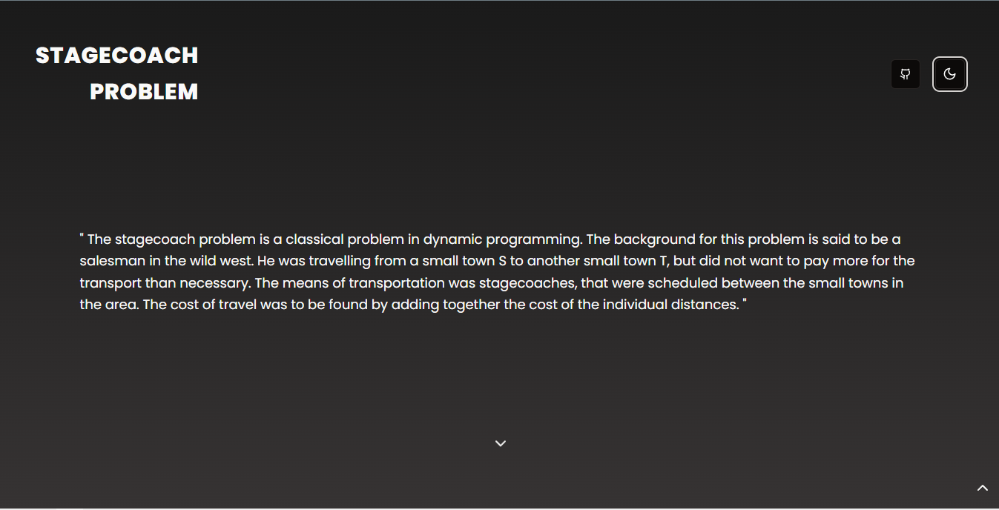

# Dynamic Programming - The Stagecoach Problem

This software is designed to help solve problems like those shown in this [book](https://www.ime.unicamp.br/~andreani/MS515/capitulo7.pdf).

## How to Use

### Nodes

- **Create Node**: Left-click on the canvas.
- **Delete Node**: Right-click on the specific node.
- **Edit Node**: Left-click on the node and select 'edit' in the node menu bar.

### Edges

- **Create Edge**:
  1. Left-click on a node.
  2. Hold the `Shift` key and click on another node (works only when two nodes are selected).
  3. Select 'new' in the paths menu bar.
- **Delete Edge**: Right-click on the specific edge.

### Additional Features

- **Save Graph**: Save the current graph to local storage.
- **Load Graph**: Load a previously saved graph from local storage.
- **Delete Graph**: Delete a saved graph from local storage.

### Solving the Problem

Once you press the 'Solve' button, the software will make a call to the backend. If the graph is correctly structured, it will generate the solution below the button.
